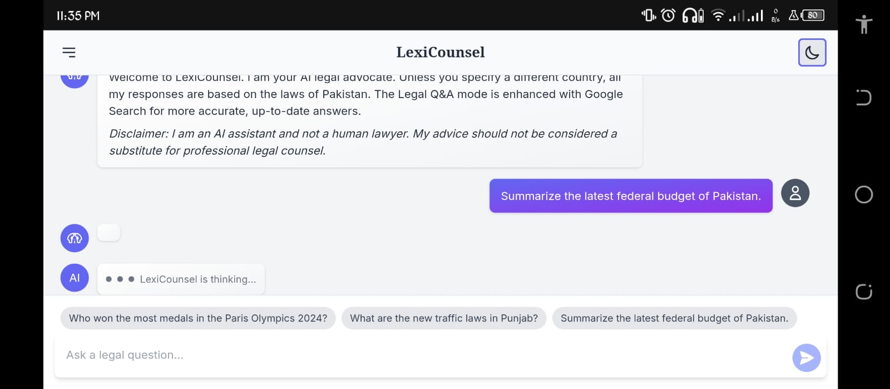
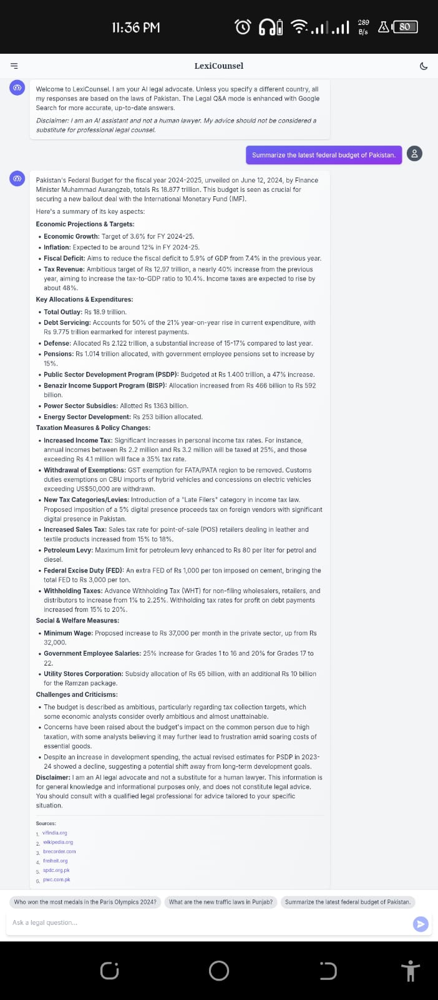
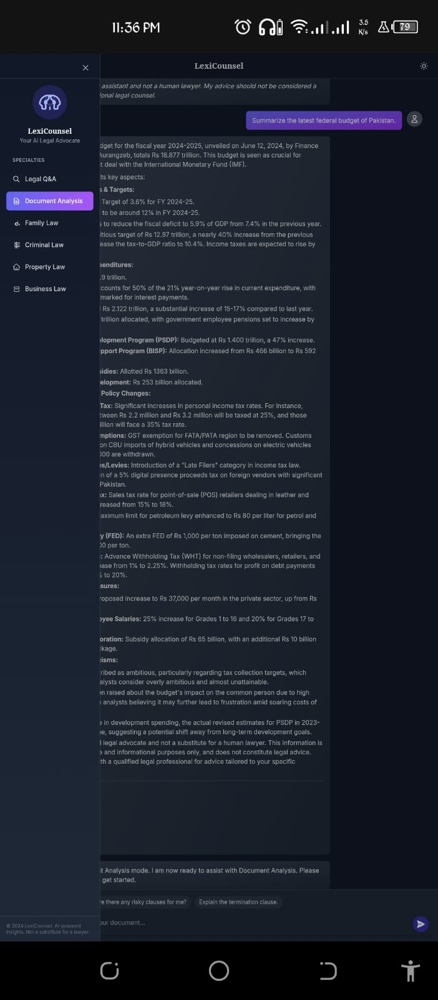
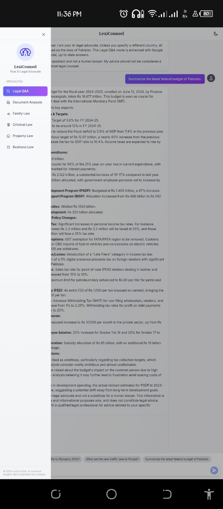
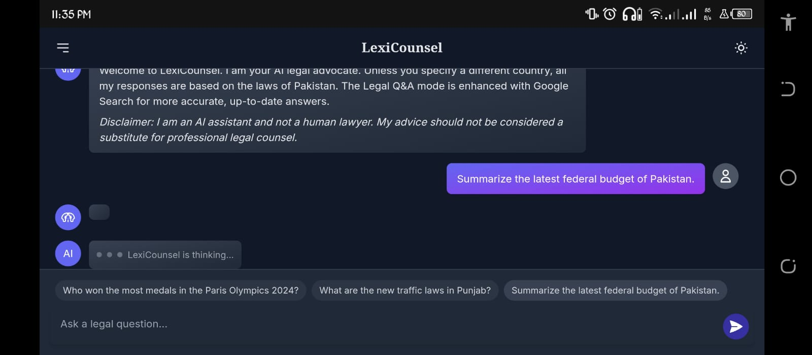

# LexiCounsel: Your AI Legal Advocate

<p align="center">
  
</p>

**LexiCounsel** is a sophisticated, AI-powered legal assistant built to demystify the complexities of law for everyone. Whether you're a student, a professional, or someone seeking to understand your rights, LexiCounsel provides accessible and insightful legal information. Our mission is to empower users by making legal knowledge more approachable and understandable.

## The "Why": Bridging the Legal Knowledge Gap

The legal world is often perceived as dense, jargon-filled, and intimidating. This creates a significant barrier for individuals and small businesses who need legal guidance but cannot afford expensive consultations for preliminary questions. LexiCounsel was born from the idea that technology, specifically generative AI, can bridge this gap. By providing a user-friendly platform for legal queries, document analysis, and specialized legal topics, we aim to democratize access to legal information, making it a public good.

## Key Features

LexiCounsel is more than just a Q&A bot. It's a comprehensive tool designed to cater to a variety of legal needs:

-   **Legal Q&A:** Our general-purpose legal question-and-answer module is your first stop for any legal query. Powered by Google Search, it provides up-to-date and factual answers, with a focus on the laws of Pakistan unless specified otherwise. Each answer is backed by sources, ensuring transparency and trust.

-   **Document Analysis:** The legal world is full of documents. LexiCounsel's Document Analysis feature allows you to upload legal documents (in various formats, including PDF, DOCX, and even images) and receive a thorough analysis. The AI will break down complex clauses, identify potential risks, and explain the document's implications in plain English.

-   **Specialized Legal Modules:** For more focused queries, LexiCounsel offers specialized modules for different areas of law:
    -   **Family Law:** Get guidance on matters like divorce, child custody, and inheritance.
    -   **Criminal Law:** Understand the intricacies of FIRs, bail, and your rights when interacting with law enforcement.
    -   **Property Law:** Navigate property transactions, disputes, and tenant rights with confidence.
    -   **Business Law:** From company registration to contract analysis, get the legal insights you need to run your business.

-   **User-Friendly Interface:** We believe that a powerful tool should also be a pleasure to use. LexiCounsel features a clean, intuitive interface with a toggleable dark mode for your comfort. The responsive design ensures a seamless experience across all your devices.

## How It Works: The Technology Stack

LexiCounsel is built on a modern, robust technology stack, chosen for its performance, scalability, and developer experience:

-   **Frontend:** The user interface is built with **React**, a popular JavaScript library for building dynamic and responsive user interfaces. We use **TypeScript** to ensure type safety and code quality.

-   **Styling:** The application is styled with **Tailwind CSS**, a utility-first CSS framework that allows for rapid and consistent styling. The dark mode is implemented using Tailwind's dark mode variants.

-   **AI and Backend:** The core of LexiCounsel is powered by the **Google Gemini API**. We leverage the `gemini-2.5-flash` model for its speed and accuracy. The backend logic is handled by **Vite**, a next-generation frontend tooling that provides a fast and lean development experience.

-   **File Handling:** For the Document Analysis feature, we use a combination of client-side file reading and Base64 encoding to securely transmit the document to the Gemini API for analysis.

## Screenshots

Here's a glimpse of LexiCounsel in action:

| Light Mode | Dark Mode |
| :---: | :---: |
|  |  |
|  |  |
|  |  |

## Getting Started: Running LexiCounsel Locally

Want to run LexiCounsel on your own machine? Here's how:

**Prerequisites:**

-   [Node.js](https://nodejs.org/) (which comes with npm)

**Installation:**

1.  **Clone the repository:**

    ```bash
    git clone https://github.com/Hassan-asim/LexiCounsel.git
    ```

2.  **Navigate to the project directory:**

    ```bash
    cd LexiCounsel
    ```

3.  **Install the dependencies:**

    ```bash
    npm install
    ```

4.  **Set up your environment variables:**

    Create a file named `.env.local` in the root of the project and add your Gemini API key:

    ```
    GEMINI_API_KEY=YOUR_API_KEY
    ```

5.  **Run the development server:**

    ```bash
    npm run dev
    ```

LexiCounsel should now be running on `http://localhost:5173`.

## Contributing

We welcome contributions from the community! If you have an idea for a new feature, a bug fix, or an improvement to the documentation, please feel free to open an issue or submit a pull request.

## Disclaimer

LexiCounsel is an AI assistant and not a human lawyer. The information provided by LexiCounsel is for informational purposes only and should not be considered a substitute for professional legal counsel. Always consult with a qualified lawyer for advice on your specific situation.
